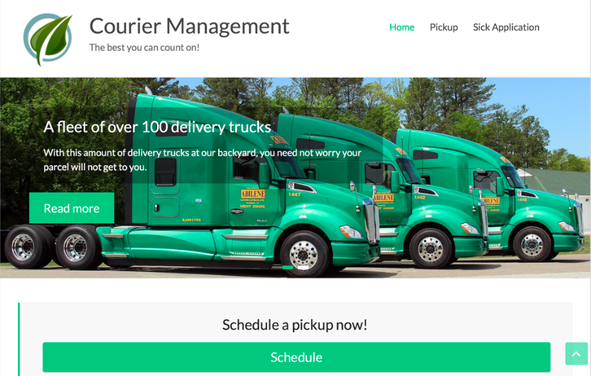
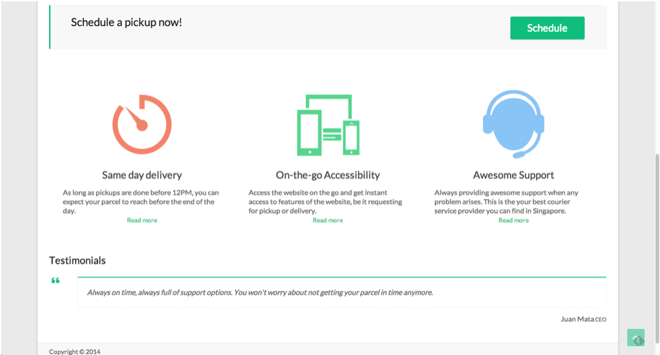
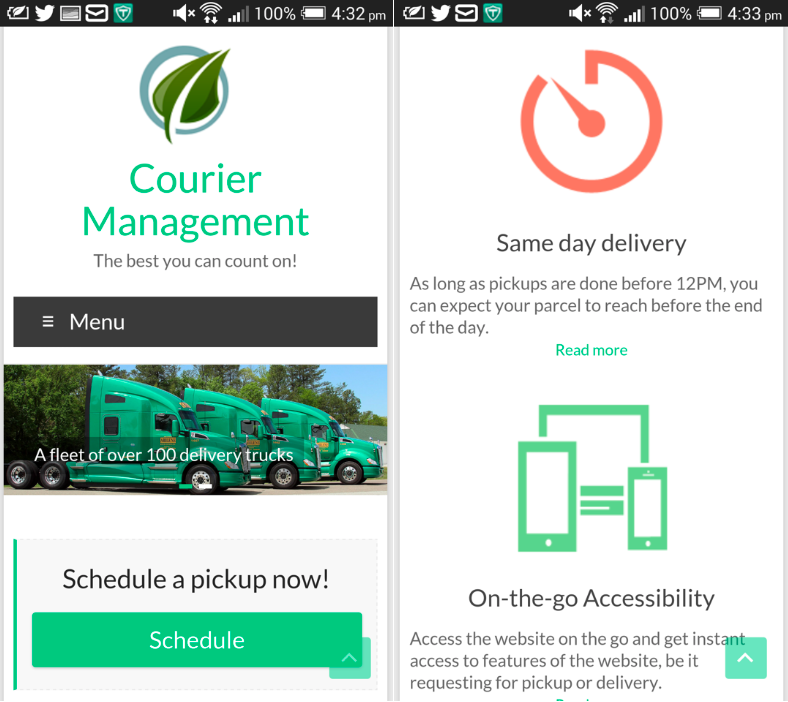
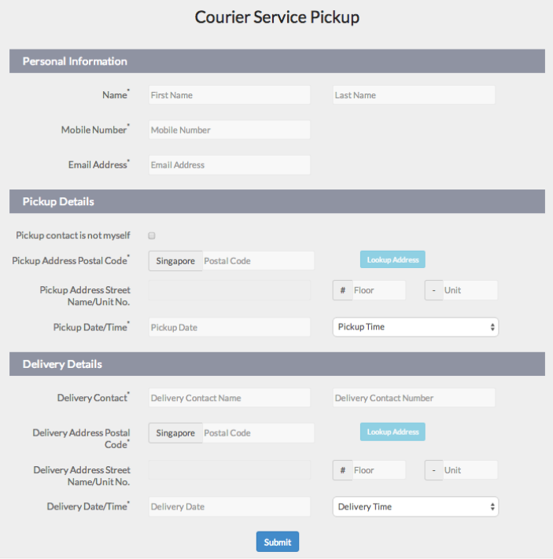
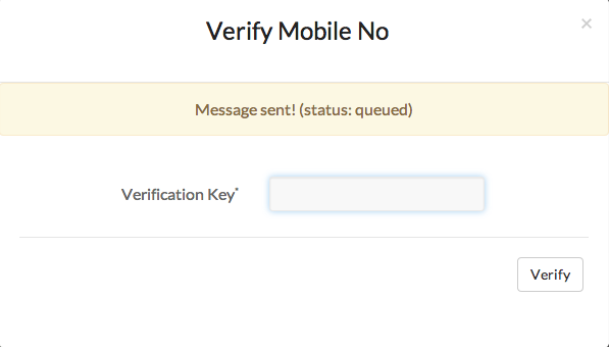
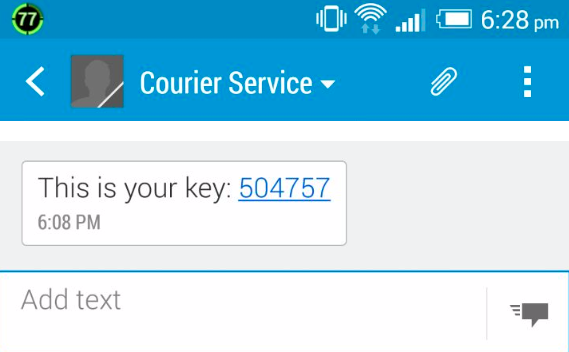
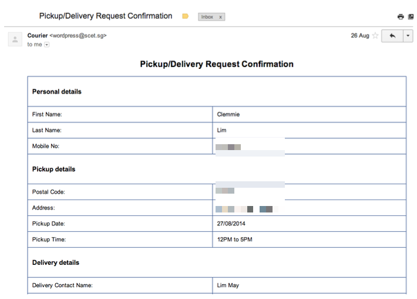
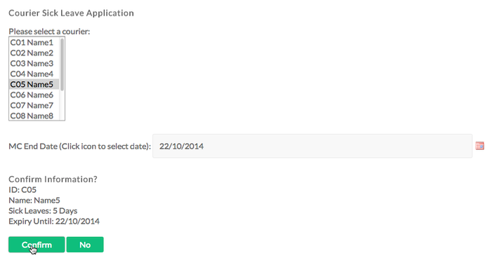

# Courier Service Management System

#### Contents
- [Abstract](https://github.com/thisisclement/Courier-Management-Service-CMS#abstract)
- [Problem statement](https://github.com/thisisclement/Courier-Management-Service-CMS#problem-statement)
- [Features](https://github.com/thisisclement/Courier-Management-Service-CMS#features)

## Abstract

A Courier Service Management System is one that users can log their delivery and pickup requests in a user interface, aggregate all captured information, rank and distribute jobs to courier personnel. This is done by segregating the system into frontend and backend components.
In many courier companies, the user interface is not intuitive enough and the courier logging process is usually very complicated. Often, a lot of information is needed to be keyed into the request form, increasing perceived workload of the user. Also, the frontend and backend solutions seldom work hand-in-hand and communications are fragmented. Furthermore, the distribution of courier jobs are generally not well distributed resulting in an imbalance number of jobs for each courier. Even if the jobs are distributed equally, the jobs cluster might not be near each other leading to unnecessary distances travelled. This can not only hurt productivity and efficiency but also lead to rising potential costs due to the extra distances covered.

The design of the system is designed using Human Computer Interaction (HCI) Design Approaches in mind. The tools and languages used are mainly Bootstrap, HTML, JavaScript, PHP and implemented using the Wordpress Content Management System (CMS).
Features include responsive design, on-the-fly form validation, one-click address lookup, simplified request logger, verification of mobile number and automated confirmation email.

## Problem statement

Due to the improvements in technology in faster processors in mobile phone chips and apps, the general user has shorter attention span. Many courier service websites do not have enough user-friendly user interfaces and have complicated details to be filled in by the user. Furthermore, the backend and frontend processes are fragmented and dilutes the customer satisfaction. Thus, there is a need for an end to end solution to plug this gap.

## Features

  1. Responsive design
  2. Simplified courier request logger
  3. On-the-fly form validation
  4. One-click address lookup
  5. 2FA of mobile number
  6. Automated confirmation email
  7. Sick leave application for staff

### 1. Responsive design

Responsive design is of the key features that are essential now that mobile growth has become so significant in Singapore. The design is able to scale onto any device’s specifications to display all information without having to zoom in and out in mobile devices.

*Tablet and desktop view*

__Mobile view__

### 2. Simplified courier request logger

The web form is segregated into different sections, namely ‘Personal Details’, ‘Pickup Details’ and ‘Delivery Details’. This is to reduce the perceived workload of the user in that it is organised and easy on the eye. Redundant details such as type of delivery service are removed from view, leaving only the pertinent details carefully planned to be displayed on the form. Simplicity is the key to any website as users are not as patient to fill in too many details which might lead to frustration.

__Simplified web form for request logging__

### 3. On-the-fly form validation

The form validation is done on the fly when the user starts to enter data into the text fields. Error messages are displayed whenever data is deemed incorrect by the system.

__Form validation happening as user types__

If fields are either empty or invalid, its respective error messages will be displayed as shown above. The state of the fields is changed to red and a cross is showed when invalid and changed to green when successful. This is to give a visual representation of the current state of each field and which fields are needing attention, making use of constraints to guide the user through the process.

### 4. One-click address lookup

The one-click address lookup is a great way to simplify the form logging process. With just a postal code required and the click of a button, the address street name will be instantly displayed. The user will not need to physically key in the long addresses as in regular web forms.

__Address lookup for ease of use__

### 5. 2FA of mobile number

Verifying of customer mobile number is paramount in the courier service industry as he is only contactable via this one number other than email. This is to commit the user and prevent any foul play by hackers and pranksters.

__2FA activated once user keys in all relevant information__

Random six digits instead of an alphanumeric code are used to facilitate keying in by customers in all walks of ages. It is however not open knowledge to users that the verification key is numeric only unless the user has used the system before, for obvious security reasons.

__SMS containing pin sent to user__

### 6. Automated confirmation email

In the final step of scheduling for a pickup or delivery, a confirmation mail will be sent to confirm all delivery and pickup details.

__Auto confirmation email sent to user__

### 7. Sick leave application for staff

There is also a way to apply for sick leave once a courier personnel has been given a Medical Certificate. Using this intuitive and responsive system, the best user experience can only be guaranteed.

__Easy-to-use interface to report sick and links with backend__

